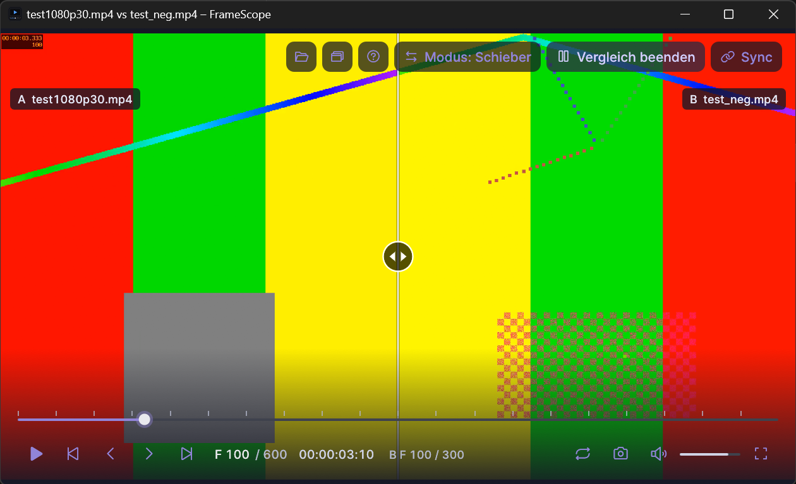

# FrameScope

Schlanker, portabler Videoplayer für Windows 11 mit Fokus auf **frame-genaue Analyse und Vergleich** –
geschrieben in Rust. Kein Installer, keine Registry-Einträge, keine Daten in `%APPDATA%`: ZIP entpacken und starten.




*Beide Screenshots zeigen synthetische Testclips; das Fenster hat keine Titelleiste, die Bedienelemente erscheinen bei Mausbewegung.*

## Features

- **Wiedergabe** von MP4/H.264, H.265, MKV, MOV, WebM, AVI u. a. (alles, was FFmpeg dekodiert)
- **Frame-genaues Stepping** vor/zurück per Pfeiltasten, Sprung zwischen **Keyframes**
- **Framecount**: aktuelle Framenummer, Gesamtzahl der Frames und Timecode `hh:mm:ss:ff`
- **Keyframe-Markierung**: Badge `KEY` am aktuellen Frame und Marker auf der Timeline
- **Timeline** mit Scrubbing, Keyframe-Markern und Loop-Bereich
- **Loop** (`I`/`O`/`L`) – ohne Marker wird das ganze Video wiederholt
- **PNG-Export** des aktuellen Frames in voller Originalauflösung (`S`)
- **Audio** mit Audio als Master-Clock (A/V-Sync), Lautstärke und Mute
- **Mehrere Instanzen** zum Vergleichen: jedes Fenster ist ein eigener Prozess (`Strg+N`)
- **A/B-Vergleich** zweier Videos in einem Fenster: Schieber über dem Bild, Nebeneinander, Überblenden
- **Synchronisierte Wiedergabe** mehrerer Fenster (Play, Pause, Seek, Einzelbild, Loop-Sprünge)
- **Fenster anordnen**: alle offenen FrameScope-Fenster auf Knopfdruck gleich groß und lückenlos im Raster (2–3 übereinander, 4 im 2×2-Raster, …)
- **Rahmenloses Fenster** ohne Titelleiste – nur das Bild; Fenstersteuerung, Verschieben (Ziehen im Bild) und Größenänderung am Rand
- **Immer im Vordergrund** (Pin-Button, `T`) und **Originalgröße** (Button, `1`): Fenster auf die Videoauflösung setzen, 1 Videopixel = 1 Bildschirmpixel
- **Klick ins Bild** startet/pausiert die Wiedergabe
- **Portable** und **Dark-UI** („Nocturne“): Controls blenden sich bei Inaktivität aus, Video im Vordergrund

## Bedienung

| Taste | Aktion |
|---|---|
| `Leertaste` oder **Klick ins Bild** | Wiedergabe / Pause |
| `←` / `→` | Ein Frame zurück / vor |
| `Umschalt` + `←` / `→` | Voriger / nächster Keyframe |
| `I` / `O` | Loop-Anfang / Loop-Ende auf den aktuellen Frame setzen |
| `L` | Loop an/aus (ohne Marker: ganzes Video) |
| `X` | Loop-Marker löschen |
| `S` | Aktuellen Frame als PNG speichern (`<videoname>_frame<nummer>.png`) |
| `Umschalt` + `S` | Wie `S`, aber Speicherort wählen (wird als neuer Standardordner gemerkt) |
| `M` | Stumm |
| `↑` / `↓` | Lautstärke ±5 % |
| `F` / `Esc` / Doppelklick | Vollbild |
| `1` | Fenster auf die **Originalgröße des Videos** setzen (1 Videopixel = 1 Bildschirmpixel) |
| `T` | Fenster **immer im Vordergrund** (an/aus) |
| `G` | Alle FrameScope-Fenster **anordnen** (siehe unten) |
| Ziehen im Bild | Fenster verschieben (im Schieber-/Überblenden-Modus am oberen Rand oder mit `Alt`) |
| `Strg` + `B` | Zweites Video **B** zum Vergleich öffnen (nochmal drücken: Vergleich beenden) |
| `C` | Vergleichsmodus wechseln (Schieber → Nebeneinander → Überblenden) |
| `Y` | Wiedergabe mit anderen FrameScope-Fenstern **synchronisieren** (an/aus) |
| `Umschalt` + `Y` | Sync-Versatz abgleichen (siehe unten) |
| `H` | Dauerhaftes Info-Overlay (Frame, Timecode, KEY) oben links |
| `Strg` + `O` | Datei öffnen |
| `Strg` + `N` | Neues Fenster (weitere Instanz) |
| `F1` | Tastenkürzel anzeigen |

Videos lassen sich per **Drag & Drop**, **Strg+O** oder als **Kommandozeilenargument** öffnen (ein zweites Argument
startet den A/B-Vergleich):

```powershell
framescope.exe "C:\Videos\clip.mp4"
```

### Fenster: rahmenlos, Vordergrund, Anordnen

Das Fenster hat **keine Titelleiste** – nur das Bild. Oben rechts erscheinen bei Mausbewegung die Schaltflächen
(Öffnen, neues Fenster, Anordnen, Vordergrund, Hilfe, Vergleichen, Sync) und die **Fenstersteuerung**
(minimieren, maximieren, schließen). Verschieben geht per **Ziehen im Bild**, die Größe ändert man an den Fensterrändern
und -ecken. Der Pin-Button (oder `T`) hält das Fenster über allen anderen. Der Button **Originalgröße** (oder `1`) setzt das Fenster
auf die Auflösung des Videos – pixelgenau 1:1; ist das Video größer als der Arbeitsbereich, wird es proportional
eingepasst, und das Fenster wird in den sichtbaren Bereich geschoben.

**Anordnen** (Button oder `G`): Alle offenen FrameScope-Fenster werden auf dem Monitor des aktuellen Fensters gleich
groß, **lückenlos und ohne Überlappung** im Raster angeordnet – 1 Fenster füllt den Arbeitsbereich, 2–3 liegen
übereinander, 4 im 2×2-Raster, 5–6 in 3×2, 7–9 in 3×3 usw. (Reihenfolge nach der bisherigen Position, zeilenweise).
Gefunden werden alle Fenster mit dem Titel „… – FrameScope“, die zu einer `framescope.exe` gehören – auch Instanzen aus
anderen Ordnern.

### Frame-Zählung, Timecode und VFR

- Beim Öffnen liest ein Hintergrund-Thread alle Videopakete (ohne zu dekodieren). Aus den Präsentationszeiten
  entsteht der Frame-Index: **Frame *n* = *n*-ter Frame in Präsentationsreihenfolge, 0-basiert** (`F 0` ist der erste,
  `F N-1` der letzte von `N` Frames). Die Keyframe-Flags stammen aus denselben Paketen.
- Der Timecode `hh:mm:ss:ff` ist nicht drop-frame. `ff` ist die Position des Frames **innerhalb seiner Sekunde**,
  gezählt anhand der tatsächlichen Präsentationszeiten. Bei konstanter Framerate entspricht das dem üblichen Timecode;
  bei **variabler Framerate (VFR)** ist es ein laufender Zähler der in dieser Sekunde angezeigten Frames. Die
  Framenummern bleiben dabei exakt.
- Bis der Index fertig ist (bei sehr großen Dateien einige Sekunden), werden Framenummer und Stepping nicht angezeigt;
  die Wiedergabe läuft sofort.
- Rückwärts-Schritte kommen aus einem Frame-Cache; bei einem Cache-Miss wird zum vorherigen Keyframe gesprungen und
  vorwärts bis zum Zielframe dekodiert.

### A/B-Vergleich (zwei Videos in einem Fenster)

Video B öffnest du über **Vergleichen…** (oben rechts), `Strg+B`, per Drag & Drop mit gedrückter `Umschalt`-Taste
(bzw. in die rechte Fensterhälfte, wenn der Vergleich schon läuft) oder direkt beim Start:

```powershell
framescope.exe "A.mp4" "B.mp4"
```

B läuft **auf der Uhr von A**: Play/Pause, Scrubbing, Einzelbild-Schritte, Keyframe-Sprünge und Loop gelten für beide
Videos zugleich; Ton kommt nur von A. Beide werden nach Zeit gepaart (bei unterschiedlicher Framerate der jeweils letzte
Frame bis zu dieser Zeit). Die Anzeige `B F 88 / 300` zeigt Frame und Gesamtzahl von B.

| Modus | Darstellung |
|---|---|
| **Schieber** | A links, B rechts der Trennlinie; Ziehen im Bild verschiebt den Schieber |
| **Nebeneinander** | beide Videos je in einer Hälfte, jeweils mit eigenem Seitenverhältnis |
| **Überblenden** | B wird über A eingeblendet; der Schieber (Ziehen im Bild) steuert die Deckkraft |

Im Schieber- und Überblenden-Modus wird B auf das Bildfeld von A gestreckt (sinnvoll für gleichen Inhalt in
unterschiedlicher Auflösung). Frame-Export (`S`) und Loop beziehen sich auf Video A.

### Synchronisierte Wiedergabe (mehrere Fenster)

Mit `Y` (oder dem Button **Sync** oben rechts) nimmt ein Fenster an der Synchronisierung teil. Alle Fenster mit
aktiviertem Sync folgen demjenigen, das **zuletzt bedient** wurde: Play/Pause, Scrubbing, Einzelbild-Schritte,
Keyframe-Sprünge und Loop-Sprünge. Play kündigt das führende Fenster ca. 250 ms im Voraus an, damit alle Fenster gemeinsam loslaufen (steht ein Fenster
schon auf dem richtigen Frame, startet es ohne Seek). Beim Abspielen sendet der Führende zweimal pro Sekunde seine Position;
weicht ein Fenster um mehr als 0,1 s ab, springt es nach (mit Vorhalt für die gemessene Seek-Dauer). Im Pausenzustand
landen alle Fenster **frame-genau** auf demselben Zeitpunkt (bei unterschiedlicher Framerate: auf dem letzten
Frame bis zu dieser Zeit).

- **Neues Fenster** (`Strg+N`) startet automatisch mit Sync, wenn Sync im aktuellen Fenster läuft.
  Per Kommandozeile: `framescope.exe --sync "clip.mp4"`.
- **Versatz abgleichen:** Haben die Videos unterschiedliche Startpunkte, gehe in beiden Fenstern an dieselbe Szene
  (Sync dazu kurz ausschalten oder erst Fenster A einstellen), schalte Sync ein und drücke im anderen Fenster
  `Umschalt+Y`. Ab dann gilt ein fester Versatz (in der Infozeile als `Sync (n) +1.234s` zu sehen).
- Technik: UDP auf `127.0.0.1` (Ports 47600–47663, höchstens 64 Fenster) – keine Firewall-Abfrage, keine Dateien,
  keine Registry; es werden keine Daten ins Netzwerk gesendet.

### Einstellungen

Einstellungen liegen in `framescope.ini` **neben der EXE** (Lautstärke, Mute, Info-Overlay, PNG-Standardordner).
Ist der Ordner nicht beschreibbar, läuft FrameScope einfach mit Standardwerten.

## Release-ZIP

`framescope-vX.Y.Z-windows-x64-portable.zip` enthält `framescope.exe`, die FFmpeg-DLLs, README und die Lizenzen.
Entpacken und `framescope.exe` starten – es muss nichts installiert werden.

## Selbst bauen

Voraussetzungen (Windows, Ziel `x86_64-pc-windows-msvc`):

1. **Rust** stable ≥ 1.88 und die **MSVC Build Tools** (inkl. Windows SDK)
2. **FFmpeg 9.0 Shared-Build (LGPL) mit Headern und Libs**, z. B. von
   [BtbN/FFmpeg-Builds](https://github.com/BtbN/FFmpeg-Builds/releases) (`ffmpeg-n9.0-latest-win64-lgpl-shared-9.0.zip`)
3. **libclang** (für `bindgen`), z. B. LLVM oder `pip install libclang`

```powershell
$env:FFMPEG_DIR    = "C:\dev\ffmpeg\ffmpeg-n9.0-latest-win64-lgpl-shared-9.0"
$env:LIBCLANG_PATH = "C:\Program Files\LLVM\bin"   # Ordner mit libclang.dll

cargo build --release
```

Falls `bindgen` die MSVC-Header nicht findet (`stdint.h not found`), die Include-Pfade über
`BINDGEN_EXTRA_CLANG_ARGS` setzen oder aus einer „x64 Native Tools Command Prompt“ bauen.

`build.rs` kopiert die FFmpeg-DLLs aus `%FFMPEG_DIR%\bin` neben die EXE (`target\release\`), damit sie direkt startet.

Portable-ZIP lokal erzeugen (wie im Release-Workflow, inkl. Smoke-Test):

```powershell
./scripts/package.ps1 -Version 0.4.0 -FfmpegDir $env:FFMPEG_DIR
```

Qualitätschecks (wie in der CI):

```powershell
cargo fmt --check
cargo clippy --all-targets -- -D warnings
cargo test
```

## Performance

Gemessen auf einem 16-Thread-Desktop (Software-Decoding, Texturupload als RGBA, Hardware-Decoding ist noch nicht eingebaut):

| Material | Ergebnis über 8 s Wiedergabe |
|---|---|
| 1080p30 H.264 | 240 Frames angezeigt, 0 verworfen |
| 1080p60 H.264 | 480 Frames angezeigt, 0 verworfen |
| 4K30 H.264 | 240 Frames angezeigt, 0 verworfen, ca. 0,5 CPU-Kerne |

Der Decoder schafft deutlich mehr als nötig (z. B. 4K: ~100 Frames/s inkl. RGBA-Konvertierung). Die Infozeile zeigt
„N verworfen“, falls Frames zu spät kommen. Mögliche spätere Optimierungen: YUV-Upload mit Shader, D3D11VA.

**Ruckelt es?** Rechts neben dem Frame-Zähler erscheint in Rot `N verworfen · M× Decoder zu langsam`, sobald Frames
ausfallen. *Verworfen* heißt: die Anzeige kam nicht hinterher (Oberfläche/Grafik, z. B. viele Fenster bei 60 fps auf
einem 60-Hz-Monitor); *Decoder zu langsam* heißt: der nächste Frame war nicht rechtzeitig dekodiert (Auflösung, Codec,
Bitrate). Zum Eingrenzen gibt es Umgebungsvariablen (vor dem Start setzen): `FRAMESCOPE_NO_VSYNC=1` (ohne V-Sync,
nur zur Diagnose), `FRAMESCOPE_DECODE_THREADS=<n>` (Decoder-Threads), `FRAMESCOPE_QUEUE=<n>` (Frames Vorlauf) und
`FRAMESCOPE_UI_PRIO=1` (Oberfläche höher priorisieren). Mit `FRAMESCOPE_LOG=1` schreibt jedes Fenster ein
Ereignisprotokoll `framescope-log-<PID>.txt` (Sync-Nachrichten, Seeks, Start/Stopp) neben die EXE.

Entwickler-Hilfen: `framescope.exe --version`, `--bench <datei>` (Decoder-Durchsatz und Index, ohne Fenster),
`--audio-selftest <datei>` (Drift der Audio-Clock) sowie die Umgebungsvariable `FRAMESCOPE_BENCH=<sekunden>`
(schreibt `framescope-bench-<PID>.txt` mit Zählern für angezeigte/verworfene Frames, Decoder-Hunger, Seeks und späte
UI-Frames neben die EXE und beendet das Programm).

## Projektstruktur

| Modul | Aufgabe |
|---|---|
| `decoder` | FFmpeg-Decoder-Thread (Seek, Frames, swscale → RGBA, Farbmatrix) |
| `index` | Paket-Scan: Frame-Index, Keyframes, Framecount |
| `player` | Uhr, Frame-Cache, Seek/Step, Loop |
| `audio` | Audio-Decoder, cpal-Ausgabe, Master-Clock |
| `timeline`, `ui`, `app` | egui-Oberfläche |
| `timecode`, `export`, `settings` | Timecode, PNG-Export, portable Einstellungen |

Details und Entscheidungen: [docs/PLAN.md](docs/PLAN.md).

## Lizenz

FrameScope steht unter der [FrameScope License (No Sale Without Permission)](LICENSE) – maßgeblich ist der englische
Lizenztext. Kurzfassung (unverbindlich):

- **Erlaubt:** nutzen (auch beruflich/kommerziell, z. B. um Videos zu analysieren), kopieren, verändern, weitergeben.
- **Nur mit vorheriger schriftlicher Genehmigung:** die Software oder abgeleitete Versionen **verkaufen** – auch als
  Teil eines bezahlten Produkts, Abos oder Dienstes, in dem sie ausgeliefert wird. Freiwillige Spenden sind kein Verkauf.
- **Pflicht:** Lizenztext und Copyright mitgeben; veränderte Versionen als verändert kennzeichnen und unter denselben
  Bedingungen weitergeben.
- Dies ist keine Open-Source-Lizenz im Sinne der OSI-Definition (wegen der Verkaufsbeschränkung).
- Die **Version 0.2.0 und älter** wurde unter der MIT-Lizenz veröffentlicht; bereits erhaltene Kopien bleiben darunter.
- Anfragen zur Genehmigung eines Verkaufs: über das [GitHub-Repository](https://github.com/supaeasy/framescope).
Es nutzt **FFmpeg** (LGPL v2.1+, dynamisch gelinkt, unverändert als DLLs beigelegt) sowie weitere Open-Source-Bibliotheken –
siehe [THIRD-PARTY-LICENSES.md](THIRD-PARTY-LICENSES.md).
