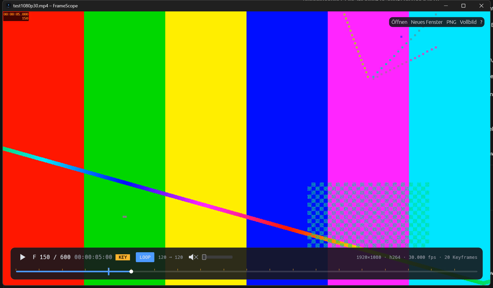

# FrameScope

Schlanker, portabler Videoplayer für Windows 11 mit Fokus auf **frame-genaue Analyse und Vergleich** –
geschrieben in Rust. Kein Installer, keine Registry-Einträge, keine Daten in `%APPDATA%`: ZIP entpacken und starten.


<!-- Screenshots-Platzhalter: docs/screenshots/player.png, compare.png, loop.png -->

## Features

- **Wiedergabe** von MP4/H.264, H.265, MKV, MOV, WebM, AVI u. a. (alles, was FFmpeg dekodiert)
- **Frame-genaues Stepping** vor/zurück per Pfeiltasten, Sprung zwischen **Keyframes**
- **Framecount**: aktuelle Framenummer, Gesamtzahl der Frames und Timecode `hh:mm:ss:ff`
- **Keyframe-Markierung**: Badge `KEY` am aktuellen Frame und Marker auf der Timeline
- **Timeline** mit Scrubbing, Keyframe-Markern und Loop-Bereich
- **Loop** (`I`/`O`/`L`) – ohne Marker wird das ganze Video wiederholt
- **PNG-Export** des aktuellen Frames in voller Originalauflösung (`S`)
- **Audio** mit Audio als Master-Clock (A/V-Sync), Lautstärke und Mute
- **Mehrere Instanzen** zum Vergleichen: jedes Fenster ist ein eigener Prozess (`Strg+N`)
- **Portable** und **Dark-UI**: Controls blenden sich bei Inaktivität aus, Video im Vordergrund

## Bedienung

| Taste | Aktion |
|---|---|
| `Leertaste` | Wiedergabe / Pause |
| `←` / `→` | Ein Frame zurück / vor |
| `Umschalt` + `←` / `→` | Voriger / nächster Keyframe |
| `I` / `O` | Loop-Anfang / Loop-Ende auf den aktuellen Frame setzen |
| `L` | Loop an/aus (ohne Marker: ganzes Video) |
| `X` | Loop-Marker löschen |
| `S` | Aktuellen Frame als PNG speichern (`<videoname>_frame<nummer>.png`) |
| `Umschalt` + `S` | Wie `S`, aber Speicherort wählen (wird als neuer Standardordner gemerkt) |
| `M` | Stumm |
| `↑` / `↓` | Lautstärke ±5 % |
| `F` / `Esc` / Doppelklick | Vollbild |
| `H` | Dauerhaftes Info-Overlay (Frame, Timecode, KEY) oben links |
| `Strg` + `O` | Datei öffnen |
| `Strg` + `N` | Neues Fenster (weitere Instanz) |
| `F1` | Tastenkürzel anzeigen |

Videos lassen sich per **Drag & Drop**, **Strg+O** oder als **Kommandozeilenargument** öffnen:

```powershell
framescope.exe "C:\Videos\clip.mp4"
```

### Frame-Zählung, Timecode und VFR

- Beim Öffnen liest ein Hintergrund-Thread alle Videopakete (ohne zu dekodieren). Aus den Präsentationszeiten
  entsteht der Frame-Index: **Frame *n* = *n*-ter Frame in Präsentationsreihenfolge, 0-basiert** (`F 0` ist der erste,
  `F N-1` der letzte von `N` Frames). Die Keyframe-Flags stammen aus denselben Paketen.
- Der Timecode `hh:mm:ss:ff` ist nicht drop-frame. `ff` ist die Position des Frames **innerhalb seiner Sekunde**,
  gezählt anhand der tatsächlichen Präsentationszeiten. Bei konstanter Framerate entspricht das dem üblichen Timecode;
  bei **variabler Framerate (VFR)** ist es ein laufender Zähler der in dieser Sekunde angezeigten Frames. Die
  Framenummern bleiben dabei exakt.
- Bis der Index fertig ist (bei sehr großen Dateien einige Sekunden), werden Framenummer und Stepping nicht angezeigt;
  die Wiedergabe läuft sofort.
- Rückwärts-Schritte kommen aus einem Frame-Cache; bei einem Cache-Miss wird zum vorherigen Keyframe gesprungen und
  vorwärts bis zum Zielframe dekodiert.

### Einstellungen

Einstellungen liegen in `framescope.ini` **neben der EXE** (Lautstärke, Mute, Info-Overlay, PNG-Standardordner).
Ist der Ordner nicht beschreibbar, läuft FrameScope einfach mit Standardwerten.

## Release-ZIP

`framescope-vX.Y.Z-windows-x64-portable.zip` enthält `framescope.exe`, die FFmpeg-DLLs, README und die Lizenzen.
Entpacken und `framescope.exe` starten – es muss nichts installiert werden.

## Selbst bauen

Voraussetzungen (Windows, Ziel `x86_64-pc-windows-msvc`):

1. **Rust** stable ≥ 1.88 und die **MSVC Build Tools** (inkl. Windows SDK)
2. **FFmpeg 9.0 Shared-Build (LGPL) mit Headern und Libs**, z. B. von
   [BtbN/FFmpeg-Builds](https://github.com/BtbN/FFmpeg-Builds/releases) (`ffmpeg-n9.0-latest-win64-lgpl-shared-9.0.zip`)
3. **libclang** (für `bindgen`), z. B. LLVM oder `pip install libclang`

```powershell
$env:FFMPEG_DIR    = "C:\dev\ffmpeg\ffmpeg-n9.0-latest-win64-lgpl-shared-9.0"
$env:LIBCLANG_PATH = "C:\Program Files\LLVM\bin"   # Ordner mit libclang.dll

cargo build --release
```

Falls `bindgen` die MSVC-Header nicht findet (`stdint.h not found`), die Include-Pfade über
`BINDGEN_EXTRA_CLANG_ARGS` setzen oder aus einer „x64 Native Tools Command Prompt“ bauen.

`build.rs` kopiert die FFmpeg-DLLs aus `%FFMPEG_DIR%\bin` neben die EXE (`target\release\`), damit sie direkt startet.

Qualitätschecks (wie in der CI):

```powershell
cargo fmt --check
cargo clippy --all-targets -- -D warnings
cargo test
```

## Projektstruktur

| Modul | Aufgabe |
|---|---|
| `decoder` | FFmpeg-Decoder-Thread (Seek, Frames, swscale → RGBA, Farbmatrix) |
| `index` | Paket-Scan: Frame-Index, Keyframes, Framecount |
| `player` | Uhr, Frame-Cache, Seek/Step, Loop |
| `audio` | Audio-Decoder, cpal-Ausgabe, Master-Clock |
| `timeline`, `ui`, `app` | egui-Oberfläche |
| `timecode`, `export`, `settings` | Timecode, PNG-Export, portable Einstellungen |

Details und Entscheidungen: [docs/PLAN.md](docs/PLAN.md).

## Lizenz

FrameScope steht unter der [MIT-Lizenz](LICENSE).
Es nutzt **FFmpeg** (LGPL v2.1+, dynamisch gelinkt, unverändert als DLLs beigelegt) sowie weitere Open-Source-Bibliotheken –
siehe [THIRD-PARTY-LICENSES.md](THIRD-PARTY-LICENSES.md).
